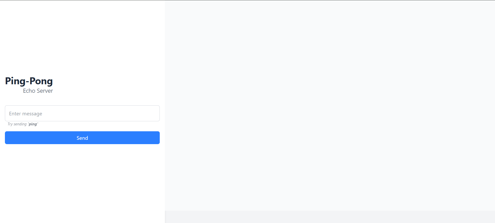
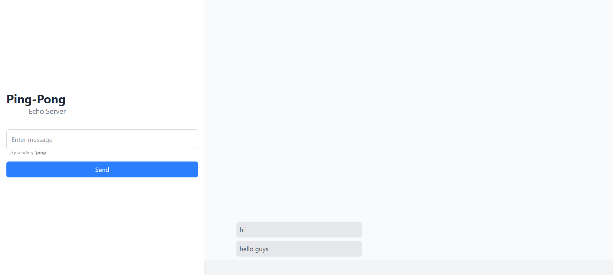
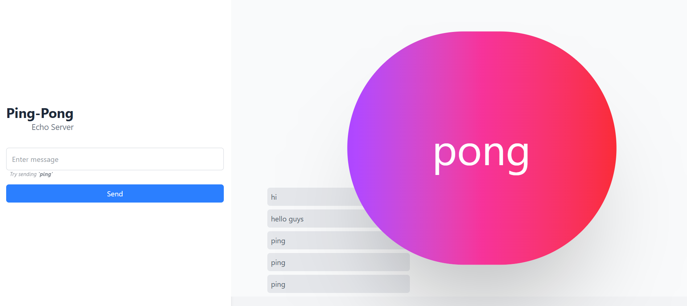
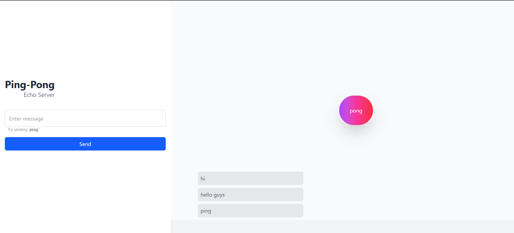

# Frontend of Ping-Pong-Echo-Server

 

## User can send messages which are rendred on the screen

## Server sends back `pong` after resceiving `ping`.

# Backend

### This server implements a simple websocket server which sends back `pong` if client sends `ping`.